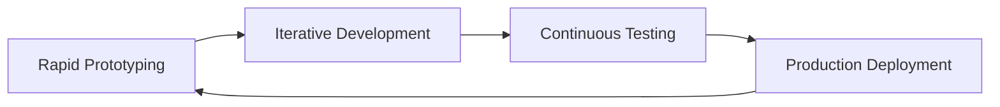

# Artisan Build
## Crafting Revenue-Driven Solutions at Breakneck Speed

Artisan Build is the result of a highly compatible working partnership between industry veterans Len Woodward and Ed Grosvenor, bringing nearly three decades of combined expertise in PHP and Laravel development. We're not just developers; we're craftsmen who understand that in today's fast-paced business environment, **time-to-revenue** is the _critical_ metric that matters.

### Our Philosophy

> "Speed without quality is a recipe for technical debt. Quality without speed is a missed opportunity. We deliver both."

We've mastered the art of rapid development without compromising on code quality or maintainability. Our success is built on three core pillars:

- 🚀 **Lightning-Fast Iteration**
- 🏗️ **Battle-Tested Architecture**
- 💎 **Maintainable Solutions**

### The Artisan Advantage

What sets us apart is our innovative approach to development workflow. We've built our own ecosystem of tools and packages that enable unprecedented development velocity while maintaining the highest standards of code quality.

### Empowering the Developer Community

We believe in the power of community-driven development. **Every single one** our packages are **source-available**, enabling developers and agencies worldwide to:

- 📖 Study and learn from our battle-tested solutions
- 🔄 Replicate our high-efficiency workflows
- 🛠️ Build upon our foundations
- 🤝 Contribute to the ecosystem

#### Join Our Developer Community

[artisan.community](https://artisan.community)

Connect with a network of passionate developers and agencies:

- 🎯 Access detailed internal documentation
- 👥 Network with fellow developers
- 💡 Share insights and experiences
- 🆘 Get direct support from our team
- 🌟 Collaborate on solutions

#### Our Most Popular Packages

| Tool | Purpose | Impact |
|------|---------|---------|
| **Kibble** | Package Management System | Orchestrates our entire package ecosystem |
| **Docsidian** | Obsidian to Web Publisher | Transforms Obsidian vaults into beautiful documentation |
| **Mirror** | Reflection Tools | Enhanced code analysis and generation |
| **Turbulence** | Event-Sourced Forms | Adds event-sourcing to Jetstream forms using Verbs |
| **Curator** | On-Demand Disk Management | Streamlined Laravel disk workflows |
| **Fat-Enums** | Enum Enhancement | Supercharges PHP enums with state-machine capabilities |
| **Adverbs** | Event Sourcing Extensions | Custom enhancements for rapid Verbs-driven development |

### The Dogfood Philosophy

We joke that we're a dogfood company, because we use everything that we build. Our [dogfood](https://github.com/artisan-build/dogfood) repository, powered by [Kibble](https://github.com/artisan-build/kibble), represents this commitment. This approach allows us to:

- ✓ Test all packages simultaneously
- ✓ Ensure perfect intercompatibility
- ✓ Coordinate versioning and publishing effortlessly
- ✓ Enforce quality standards across all packages
- ✓ Deploy with confidence

### Our Process

### Why Choose Artisan Build?

1. **Decades of Experience**
   - Nearly 30 years combined PHP expertise
   - Deep Laravel ecosystem knowledge
   - Battle-tested architectural patterns

2. **Proven Methodology**
   - Custom-built workflow tools
   - Integrated testing frameworks
   - Automated quality assurance

3. **Focus on Results**
   - Rapid time-to-revenue
   - Scalable solutions
   - Maintainable codebases

4. **Community-Driven**
   - Source-available packages
   - Active developer community
   - Direct access to expertise
   - Comprehensive documentation

### Get in Touch

Ready to transform your ideas into reality at unprecedented speed? Let's build something amazing together.

[🌐 Website](https://artisan.build) | [📧 Contact Us](mailto:hello@artisan.build) | [💼 View Our Work](https://artisan.build/portfolio) | [👥 Join Our Community](https://artisan.community)

  Built with ❤️ by Artisan Build and powered by our amazing developer community

